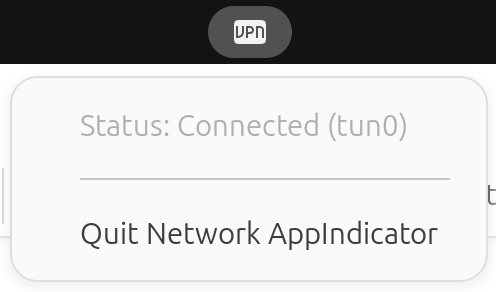
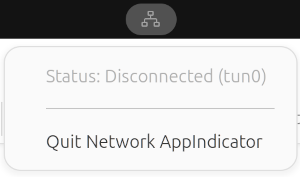

# Network AppIndicator

A lightweight Python script for Linux desktop environments that monitors the status of your VPN connection (or any particular network interface, `tun0` by default) and displaying a persistent status icon in the system tray.

This Python script utilizes the AppIndicator protocol, which is the standard mechanism for creating system tray icons on modern Linux desktops. The script is expected to work well under the following desktop environments (DEs), sometimes requiring a corresponding extension to be active:
* **GNOME Shell**: Works reliably when the **KStatusNotifierItem/AppIndicator Support** extension is installed and enabled.
* **KDE Plasma**: Supports AppIndicators through its built-in System Tray widget.
* **Cinnamon, MATE, XFCE**: Generally works well, as these DEs usually include support for libappindicator or a compatible implementation.




## Installation

1. Clone this repository or download the [network_appindicator.py](network_appindicator.py) script directly.
2. Ensure you have Python 3, the `gi` Python package, and the `AyatanaAppIndicator3` gir bindings installed.
    * **Ubuntu/Debian**:
        ```bash
        sudo apt install python3-gi gir1.2-ayatanaappindicator3-0.1
        ```


## Usage

Navigate to the directory containing the `network_appindicator.py` script and run:
```bash
python3 network_appindicator.py
```

## Customization

If you want to monitor a different network interface than `tun0`, you can modify the `INTERFACE` variable directly in the script.

## Autostart

To have the script start automatically when you log in to your desktop, create the following file as `.config/autostart/network_appindicator.desktop` under your home directory, adjusting `Exec` to include the full path to the script:
```ini
[Desktop Entry]
Type=Application
Exec=/usr/bin/python3 /path/to/repo/network_appindicator.py
Hidden=false
X-GNOME-Autostart-enabled=true
Name=Network AppIndicator
Comment=Displays status of a network interface in the system tray
```
